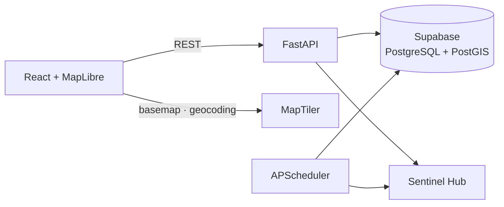

# SattelishMaps

[](LICENSE)
[](https://www.python.org/downloads/)
[](https://fastapi.tiangolo.com/)
[](https://www.docker.com/)

Satellite imagery analysis platform for **Slovakia**: Sentinel-2 environmental
indices on an interactive map, with per-pixel analytics for any selected area.

## Key Features

-  **Interactive Mapping**: NDVI / NDWI / NDBI / Moisture layers on a MapLibre GL map, locked to Slovakia.
-  **Per-Pixel Analytics**: select any area (drag or city search) → statistics, timeseries, histogram, and change detection computed from raw pixel values stored in PostGIS.
-  **Tile Cache & DB Rendering**: tiles are cached in the database and can be re-rendered from stored pixels without touching Sentinel Hub quota.
-  **Scheduler**: background jobs keep region statistics fresh and evict stale tiles.
-  **Exports**: chart PNG and self-contained HTML reports.
-  **Dockerized**: dev (hot-reload) and production compose setups.

## Architecture at a glance



Full picture: [docs/architecture/overview.md](docs/architecture/overview.md)

## Technology Stack

- **Backend**: FastAPI, APScheduler, NumPy/Pillow, Sentinel Hub API
- **Frontend**: React, TypeScript, Vite, MapLibre GL JS, Chart.js, TailwindCSS
- **Database**: PostgreSQL with PostGIS (via Supabase), partitioned pixel storage
- **Infrastructure**: Docker & Docker Compose

## Quick Start

### Prerequisites
- Docker & Docker Compose
- Sentinel Hub Account (Client ID & Secret)
- Supabase Project (DB Connection String)

### Installation

1. **Clone the repository**
   ```bash
   git clone https://github.com/Skriplss/SattelishMaps.git
   cd SattelishMaps
   ```

2. **Configure Environment**
   ```bash
   cp .env.example .env
   # Edit .env with your credentials
   ```

3. **Create the database schema** — run `database/schemas/init.sql` in your
   Supabase SQL Editor (details: [database/README.md](database/README.md)).

4. **Start Services**
   ```bash
   docker compose up -d                          # production
   docker compose -f docker-compose.dev.yml up   # development (hot-reload)
   ```

5. **Access the Application**
   - Frontend: http://localhost:3000
   - Backend API Docs: http://localhost:8000/docs

## Documentation

Start at the **[documentation index](docs/README.md)**. Highlights:

- **[System Architecture](docs/architecture/overview.md)**: diagrams and data flows.
- **[Backend Guide](docs/backend/README.md)**: API, services, scheduler.
- **[Database Schema](docs/database/schema.md)**: ER diagram, partitioning, RPCs.
- **[Frontend Architecture](docs/frontend/architecture.md)** and **[Features](docs/frontend/features.md)**.
- **[Deployment](docs/deployment/docker-setup.md)**: Docker dev & production setup ([server guide](docs/deployment/production.md)).
- **[Architecture Decisions](docs/architecture/decisions/)**: ADRs recording key technical choices.

## License

This project is licensed under the MIT License - see the [LICENSE](LICENSE) file for details.

## Authors

- **Skriplss** - [GitHub](https://github.com/Skriplss)
- **WraithCipher** - [GitHub](https://github.com/WraithCipher)
- **Dxfluxite** - [GitHub](https://github.com/Dxfluxite)
- **r0sEm** - [GitHub](https://github.com/r0sEm)
