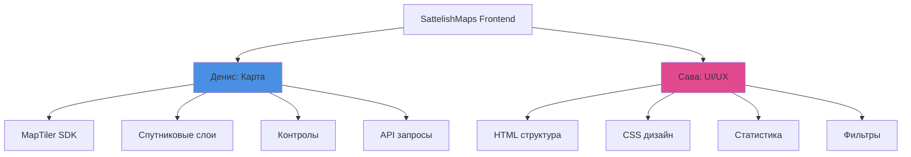

# 🚀 Быстрая справка - Кто что делает

## 👨‍💻 Денис - Карта
```
Папка: frontend/js/
Файлы: map.js, layers.js, map-controls.js, api.js

Задачи:
✅ MapTiler карта
✅ Спутниковые слои (Sentinel-2.5)
✅ Контролы карты (зум, переключение)
✅ Popup с информацией
✅ API интеграция
```

## 🎨 Сава - UI/UX
```
Папка: frontend/css/, frontend/components/
Файлы: main.css, components.css, statistics.js, filters.js

Задачи:
✅ Дизайн и layout
✅ Header, Sidebar, Stats Panel
✅ Графики (Chart.js)
✅ Фильтры (даты, облачность)
✅ UI компоненты
```

---

## 📊 Разделение по компонентам



---

## ⏰ Таймлайн (День 1)

| Время | Денис | Сава |
|-------|-------|------|
| **0-1 час** | Настройка MapTiler | HTML структура + стили |
| **1-2 часа** | Первый спутниковый слой | Header + Sidebar |
| **2-3 часа** | Контролы карты | Stats Panel + метрики |
| **3-4 часа** | API интеграция | Chart.js + первый график |

---

## 🔗 Точки интеграции

### Что нужно согласовать:
1. **Цвета** - единая палитра
2. **Размеры панелей** - ширина sidebar/stats
3. **События** - карта → статистика
4. **API формат** - структура данных

### Когда встречаться:
- ⏰ **Начало** - обсудить дизайн
- ⏰ **Середина дня** - проверить прогресс
- ⏰ **Конец дня** - интеграция

---

## 📁 Файловая структура

### Денис:
```
frontend/
├── js/
│   ├── map.js           ← Основная логика карты
│   ├── layers.js        ← Управление слоями
│   ├── map-controls.js  ← Контролы
│   └── api.js           ← API (совместно)
└── css/
    └── map.css          ← Стили карты
```

### Сава:
```
frontend/
├── index.html           ← Основная страница
├── js/
│   ├── main.js          ← Главный файл
│   ├── statistics.js    ← Графики
│   ├── filters.js       ← Фильтры
│   └── ui.js            ← UI компоненты
├── css/
│   ├── main.css         ← Основные стили
│   ├── components.css   ← Стили компонентов
│   └── responsive.css   ← Адаптивность
└── components/
    ├── header.html      ← Шапка
    ├── sidebar.html     ← Боковая панель
    └── stats-panel.html ← Панель статистики
```

---

## ✅ MVP Чеклист

### Денис:
- [ ] Карта отображается
- [ ] Загружается спутниковый слой
- [ ] Работает зум
- [ ] API запросы работают

### Сава:
- [ ] HTML структура готова
- [ ] Основные стили применены
- [ ] Фильтр по дате работает
- [ ] Минимум 1 график отображается

### Вместе:
- [ ] Карта + UI интегрированы
- [ ] Фильтры обновляют карту
- [ ] Карта обновляет статистику

---

## 🆘 Быстрая помощь

| Проблема | Действие |
|----------|----------|
| Карта не загружается | Проверь API ключ MapTiler |
| Слой не отображается | Console.log данных от API |
| Стили не применяются | Проверь путь к CSS |
| График не рисуется | Проверь формат данных Chart.js |
| Конфликт в Git | Позови Диму |

---

## 🎯 Приоритеты

### ВЫСОКИЙ (сделать обязательно):
- Базовая карта (Денис)
- Один спутниковый слой (Денис)
- HTML + CSS структура (Сава)
- Панель статистики (Сава)

### СРЕДНИЙ (желательно):
- Несколько типов слоев (Денис)
- Popup (Денис)
- Все графики (Сава)
- Фильтры (Сава)

### НИЗКИЙ (если останется время):
- Выбор области (Денис)
- Мобильная версия (Сава)
- Анимации (Сава)

---

**Полная документация**: [FRONTEND_TASKS.md](file:///c:/repozitories/SattelishMaps/docs/FRONTEND_TASKS.md)
