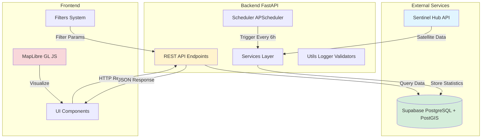
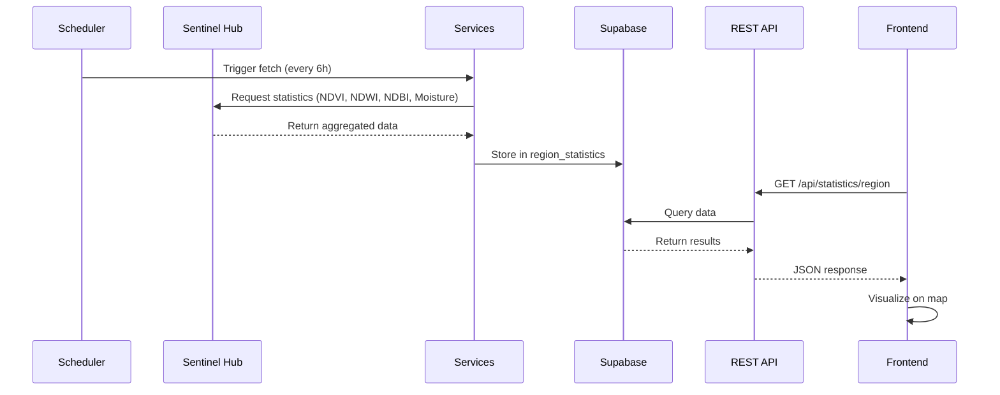
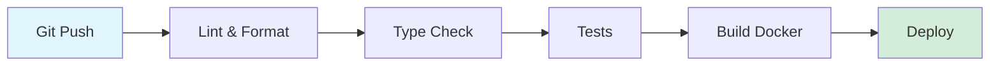

# Архітектура SattelishMaps

Огляд архітектури системи для моніторингу навколишнього середовища через супутникові дані.

## 📐 Загальна схема



## 🏗️ Компоненти системи

### 1. Backend (FastAPI)
- **REST API** - Endpoints для отримання даних
- **Scheduler** - Автоматичне завантаження даних кожні 6 годин
- **Services** - Бізнес-логіка та інтеграції
- **Utils** - Логування, валідація, обробка помилок

### 2. Frontend (Vanilla JS)
- **MapLibre GL** - Інтерактивна карта
- **UI Components** - Фільтри, легенда, інформаційні панелі
- **API Integration** - Комунікація з backend

### 3. Database (Supabase)
- **PostgreSQL** - Реляційна БД
- **PostGIS** - Геопросторові розширення
- **Tables** - region_statistics для зберігання індексів

### 4. External Services
- **Sentinel Hub** - Джерело супутникових даних
- **Supabase** - Хостинг БД

## 📊 Потік даних

Детальний опис потоку даних: [Data Flow](data-flow.md)



## 🔑 Ключові рішення

Архітектурні рішення задокументовані у форматі ADR (Architecture Decision Records):

- [ADR-001: System Architecture](adr/001-system-architecture.md) - Вибір FastAPI + Supabase + Docker
- [ADR-002: Database Choice](adr/002-database-choice.md) - Чому Supabase/PostgreSQL/PostGIS
- [ADR-003: Frontend Framework](adr/003-frontend-framework.md) - Vanilla JS + MapLibre GL

## 🛠️ Технологічний стек

### Backend
| Технологія | Версія | Призначення |
|-----------|--------|-------------|
| Python | 3.11+ | Основна мова |
| FastAPI | 0.104+ | Web framework |
| APScheduler | 3.10+ | Автоматизація |
| Rasterio | 1.3+ | Обробка растрів |
| Shapely | 2.0+ | Геометрія |
| httpx | 0.25+ | HTTP клієнт |

### Frontend
| Технологія | Версія | Призначення |
|-----------|--------|-------------|
| MapLibre GL JS | 3.x | Інтерактивні карти |
| Vanilla JavaScript | ES6+ | Логіка |
| CSS3 | - | Стилізація |

### Infrastructure
| Технологія | Версія | Призначення |
|-----------|--------|-------------|
| Docker | 20.10+ | Контейнеризація |
| Docker Compose | 2.0+ | Оркестрація |
| Nginx | 1.24+ | Web сервер |
| PostgreSQL | 15+ | База даних |
| PostGIS | 3.3+ | Геопросторові функції |

## 📁 Структура проекту

```
SattelishMaps/
├── backend/
│   ├── api/                 # API endpoints
│   │   ├── satellite.py     # Satellite data endpoints
│   │   ├── statistics.py    # Statistics endpoints
│   │   └── indices.py       # Indices endpoints
│   ├── services/            # Business logic
│   │   ├── sentinelhub_service.py
│   │   └── supabase_service.py
│   ├── models/              # Pydantic models
│   ├── utils/               # Utilities
│   │   ├── logger.py
│   │   ├── validators.py
│   │   └── error_handlers.py
│   ├── config/              # Configuration
│   │   └── settings.py
│   ├── scheduler.py         # APScheduler
│   └── app.py              # FastAPI app
├── frontend/
│   ├── js/
│   │   ├── map.js          # Map component
│   │   ├── api.js          # API integration
│   │   ├── filters.js      # Filters logic
│   │   └── colormap.js     # Color mapping
│   ├── css/
│   │   └── styles.css
│   └── index.html
├── database/
│   └── schema.sql          # DB schema
├── docs/                   # Documentation
└── docker-compose.yml      # Docker config
```

## 🔐 Безпека

### Аутентифікація
- Supabase Row Level Security (RLS)
- API keys для Sentinel Hub

### CORS
- Налаштовані дозволені origins
- Credentials підтримка

### Secrets Management
- Environment variables
- `.env` файли (не в Git)
- Docker secrets для production

## 📈 Масштабованість

### Горизонтальне масштабування
- Backend: Можна запустити кілька інстансів за load balancer
- Frontend: Статичні файли через CDN

### Вертикальне масштабування
- Збільшення ресурсів контейнерів
- Оптимізація запитів до БД

### Кешування
- HTTP кешування для статичних даних
- Database query caching

## 🔄 CI/CD

Рекомендована pipeline:



Детальніше: [Development Guide](../development/README.md)

## 📚 Додаткові ресурси

- [System Overview](system-overview.md) - Детальний огляд компонентів
- [Data Flow](data-flow.md) - Потік даних через систему
- [ADR Directory](adr/) - Всі архітектурні рішення

## Наступні кроки

- 📖 Вивчіть [API Documentation](../api/README.md)
- 🔧 Ознайомтеся з [Backend Structure](../backend/structure.md)
- 🎨 Перегляньте [Frontend Architecture](../frontend/README.md)
