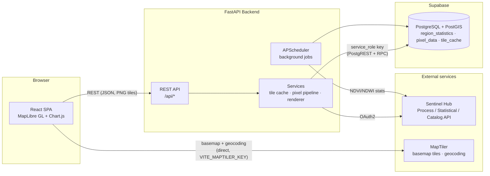
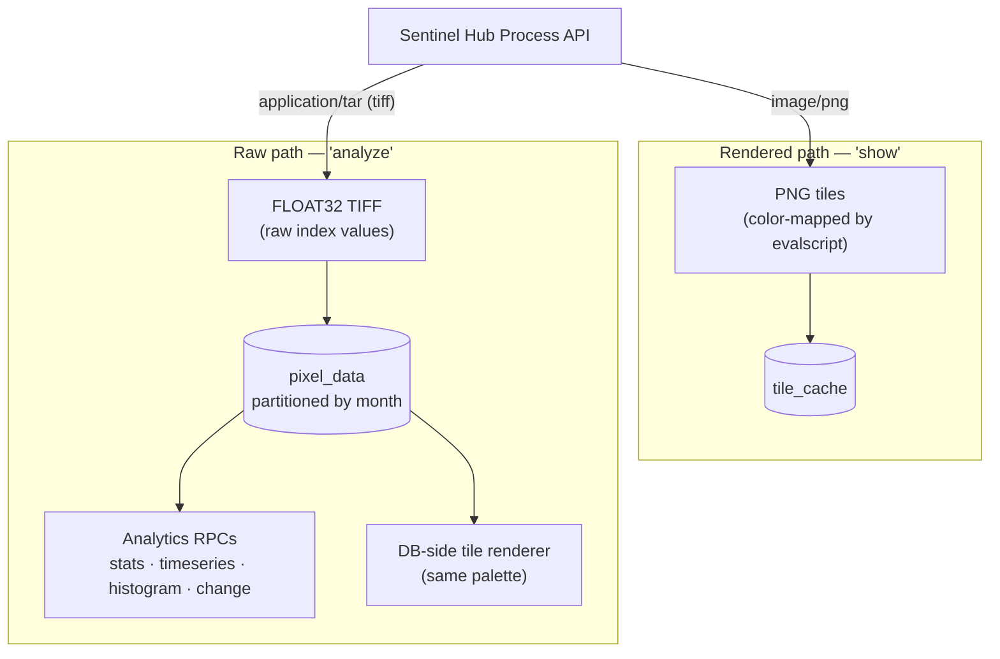
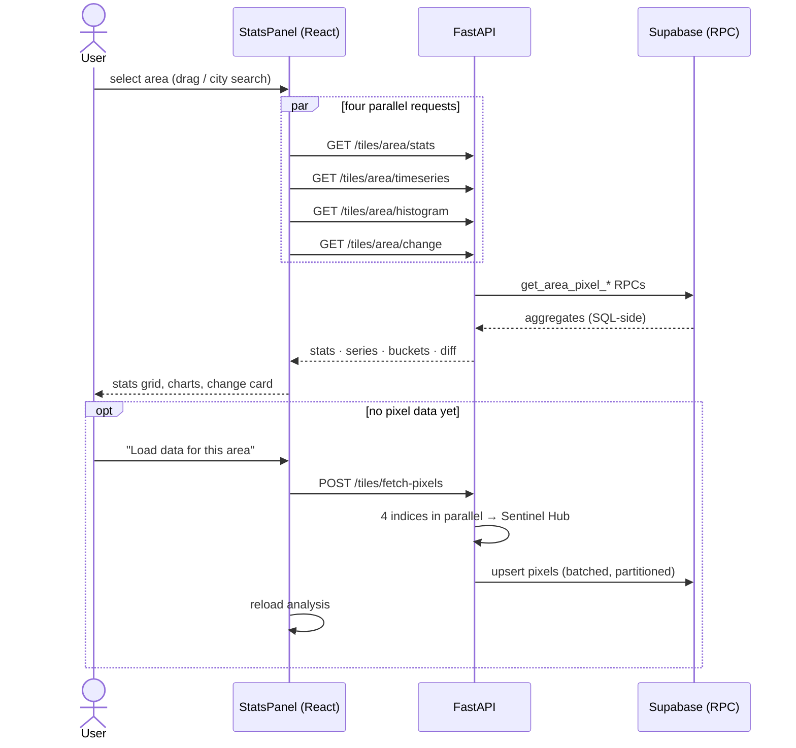

# System Architecture

SattelishMaps is a three-tier system: a React SPA, a FastAPI backend, and a
Supabase (PostgreSQL + PostGIS) database, with Sentinel Hub as the satellite
data provider and MapTiler for basemaps and geocoding.

## High-level view

Key boundaries:

- The **frontend never talks to Supabase directly** — all data access goes
  through the backend, which uses the `service_role` key (RLS is enabled with
  no public policies).
- The frontend talks to **MapTiler directly** (basemap styles + geocoding),
  authenticated with `VITE_MAPTILER_KEY`.
- All Sentinel Hub traffic goes through the backend; requests outside the
  configured **coverage area (Slovakia, `COVERAGE_BBOX`)** are rejected or
  served as transparent tiles so quota is never spent outside the product
  scope.

## Two data models: rendered vs raw

The same Sentinel-2 scenes power two distinct paths:

- **Rendered path**: quick visualization; tiles are cached in `tile_cache`
  and reused (see [backend/services.md](../backend/services.md)).
- **Raw path**: per-pixel FLOAT32 values stored with coordinates in
  `pixel_data`; powers area statistics, histograms, change detection, and
  can render tiles itself without Sentinel Hub (`PREFER_PIXEL_TILES`).

## Request lifecycles

### Area analysis (user selects an area on the map)

All aggregation happens **in SQL** (RPC functions) — the backend never pulls
raw pixel rows to compute statistics.

## Coverage constraint

The product serves Slovakia only. The constraint is enforced at every layer:

| Layer | Mechanism |
|---|---|
| Map UI | `maxBounds` + `minZoom` lock the viewport to Slovakia |
| Area selection | client-side clamp to `COVERAGE` bbox (`src/config.ts`) |
| Geocoding | `country=sk` + bbox filter |
| Backend tiles | out-of-coverage tiles → transparent PNG, no Sentinel Hub call |
| Backend data APIs | out-of-coverage bbox → HTTP 400 |

Coverage is configuration, not code: change `COVERAGE_BBOX` (backend) and
`COVERAGE` / `MAP_MAX_BOUNDS` (frontend `src/config.ts`) to serve another
region.

## Technology stack

| Tier | Tech | Notes |
|---|---|---|
| Frontend | React 18, TypeScript, Vite | code-split: maplibre / charts / app chunks |
| Mapping | MapLibre GL JS | raster tiles from backend, theme-aware basemap |
| Charts | Chart.js + react-chartjs-2 | line, bar (histogram) |
| Backend | FastAPI, Python 3.11 | async, OpenAPI at `/docs` (DEBUG only) |
| Scheduler | APScheduler | interval jobs in-process |
| Database | Supabase (PostgreSQL 15 + PostGIS) | PostgREST + SQL RPCs, RLS locked |
| Satellite data | Sentinel Hub (Sentinel-2 L2A) | Process / Statistical / Catalog APIs |
| Infra | Docker Compose | dev (hot-reload) and prod variants |
