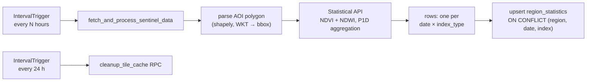

# Background Scheduler

`backend/scheduler.py` — an `AsyncIOScheduler` (APScheduler) started from the
FastAPI lifespan hook. Singleton: `satellite_scheduler`.

## Configuration

| Env var | Default | Meaning |
|---|---|---|
| `SCHEDULER_ENABLED` | `true` | Master switch (dev compose defaults it to `false`) |
| `SCHEDULER_INTERVAL_HOURS` | `4` | Statistics fetch cadence |
| `DEFAULT_SEARCH_BOUNDS` | Trnava polygon (WKT) | AOI for the stats job |
| `DEFAULT_REGION_NAME` | `Trnava` | `region_name` written to the DB |
| `PROCESS_HISTORICAL_DATA` | `false` | Run the fetch immediately on startup |

## Jobs

| Job id | Trigger | What it does |
|---|---|---|
| `fetch_sentinel_data` | every `SCHEDULER_INTERVAL_HOURS` | Pulls NDVI/NDWI aggregates from the Sentinel Hub **Statistical API** for the configured AOI and upserts long-format rows into `region_statistics` |
| `cleanup_tile_cache` | every 24 h | RPC `cleanup_tile_cache(30)` — deletes tiles not accessed for 30 days |



Both jobs run with `max_instances=1` — a slow run never overlaps the next one.

## Monitoring

```http
GET /api/scheduler/status
```

```json
{
  "enabled": true,
  "running": true,
  "interval_hours": 4,
  "last_run": "2026-07-11T02:00:00",
  "total_runs": 12,
  "successful_runs": 12,
  "failed_runs": 0
}
```

## Manual runs

```bash
cd backend
python scripts/fetch_now.py                # last 180 days for the configured AOI
python scripts/fetch_historical_stats.py   # 12 months for 5 Slovak regions
```
