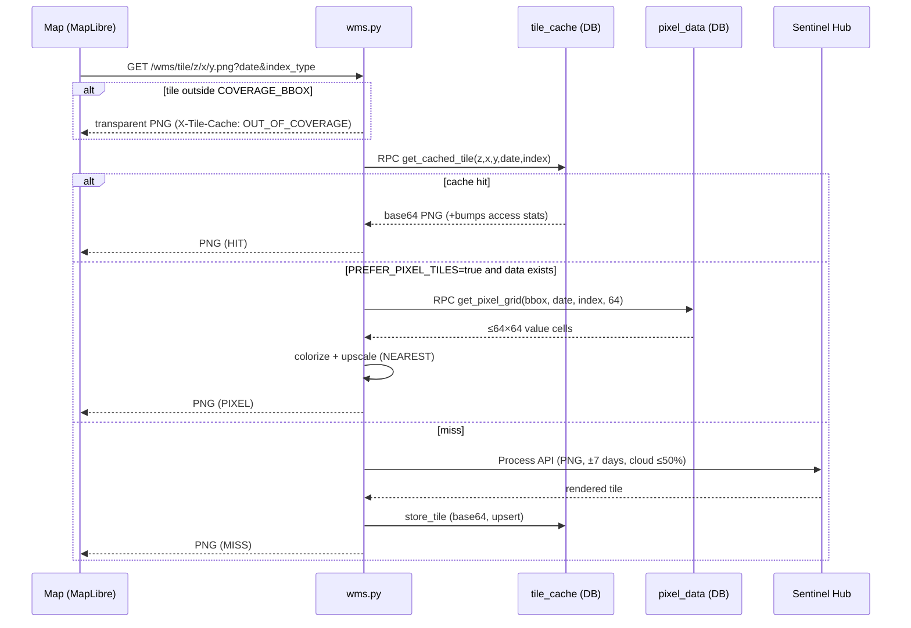
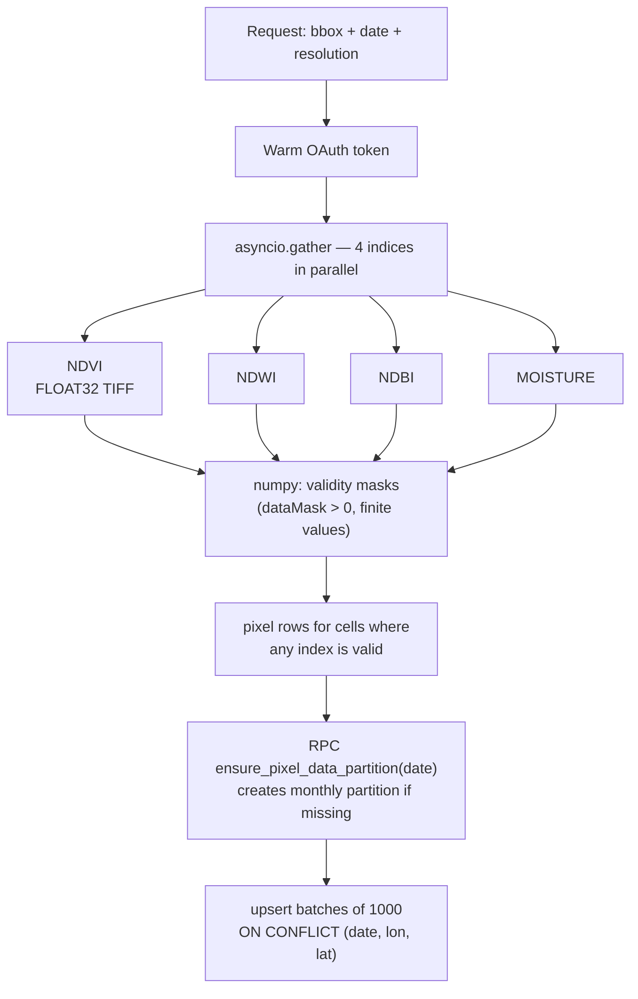

# Service Layer

All business logic lives in `backend/services/` as module-level singletons.

| Service | File | Responsibility |
|---|---|---|
| `supabase_service` | `supabase_service.py` | The only entry point to the database (PostgREST + RPC) |
| `sentinel_hub_wms_service` | `sentinel_hub_wms_service.py` | Sentinel Hub **Process API** via raw HTTP: rendered PNGs and raw FLOAT32 pixel values. OAuth token caching, pooled `requests.Session`, 60 s timeouts |
| `sentinelhub_service` | `sentinelhub_service.py` | Sentinel Hub **Statistical + Catalog API** via the `sentinelhub` SDK (aggregated NDVI/NDWI stats for the scheduler) |
| `tile_cache_service` | `tile_cache_service.py` | Tile caching, pixel-data pipeline, area analytics RPC calls, DB-side tile rendering |
| `pixel_tile_renderer` | `pixel_tile_renderer.py` | Pure functions: value grid → colored PNG (palettes identical to the evalscripts) |

## Tile serving pipeline

`GET /api/wms/tile/{z}/{x}/{y}.png` — the endpoint the map actually calls:

Cache failures never fail tile serving — `store_tile` errors are logged and
swallowed. Stale tiles are evicted daily (see [scheduler.md](scheduler.md)).

## Pixel data pipeline

`POST /api/tiles/fetch-pixels` / `scripts/fetch_pixel_data.py`:

Notes:

- Sentinel Hub returns a tar of TIFFs (`default` = values, `dataMask` =
  validity); decoded with Pillow + numpy, no temp files.
- Pixel coordinates are grid-cell centers computed from the bbox, so
  re-fetching the same bbox/resolution upserts onto the same rows —
  this is what makes change detection joins work.

## DB-side tile rendering

`tile_cache_service.render_tile_from_pixels` + `pixel_tile_renderer`:

1. `get_pixel_grid` RPC aggregates pixels into ≤64×64 cells **in SQL**
   (bounded output regardless of zoom or pixel density).
2. Grid is colorized with `COLOR_SCALES` — thresholds copied 1:1 from the
   Sentinel Hub evalscripts, so DB tiles are visually identical.
3. NaN cells → transparent; upscaled to 256×256 with nearest-neighbor.
4. Fewer than 4 populated cells → `None` (caller falls through to
   Sentinel Hub).

## Area analytics

`tile_cache_service` methods are thin wrappers over SQL RPCs — aggregation
never happens in Python:

| Method | RPC |
|---|---|
| `get_area_statistics` | `get_area_pixel_stats` (mean/median/min/max/std/count) |
| `get_area_timeseries` | `get_area_pixel_timeseries` |
| `get_area_histogram` | `get_area_pixel_histogram` |
| `get_area_change` | `get_area_pixel_change` |

See [../database/schema.md](../database/schema.md) for the RPC definitions.
