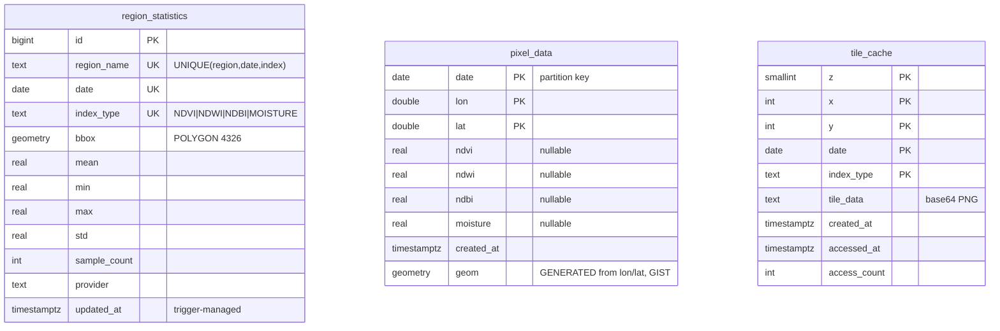
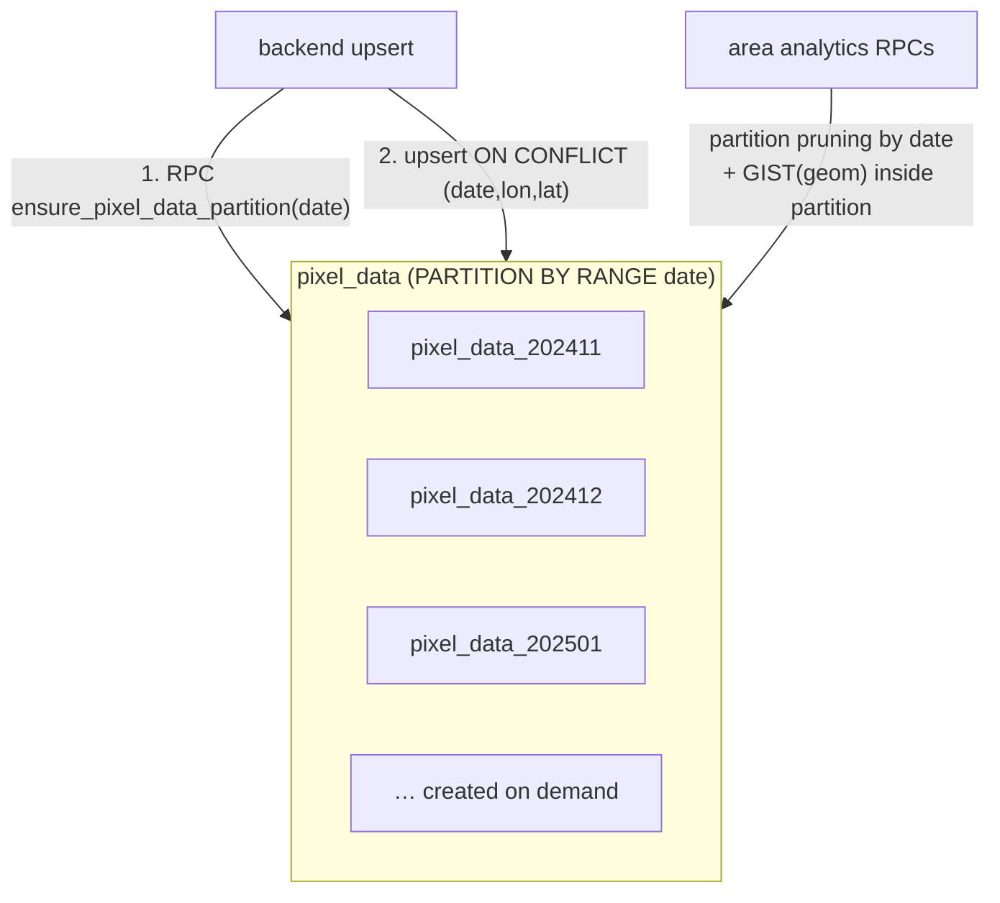

# Database Schema

Single source of truth: [`database/schemas/init.sql`](../../database/schemas/init.sql).
Setup instructions: [`database/README.md`](../../database/README.md).

## Entity overview

The three tables are independent (no foreign keys) — they represent three
different granularities of the same satellite data:

Design decisions (details in [ADR-003](../architecture/decisions/003-database-redesign.md)):

- **Long format** for `region_statistics` — one row per region × date × index.
- **No UUID PKs** — natural composite keys save ~40 bytes/row on the
  high-volume tables and give upserts their conflict target for free.
- **`tile_data` as base64 TEXT** — PostgREST does not round-trip BYTEA
  reliably.

## pixel_data partitioning

- Monthly partitions, created lazily by `ensure_pixel_data_partition(date)`
  (SECURITY DEFINER) — the backend calls it before every pixel upsert.
- Indexes are declared on the parent and propagate to every partition.
- Queries always filter by `date`, so the planner prunes to one partition,
  then uses the GIST index on the generated `geom` column.

## RPC functions

| Function | Purpose |
|---|---|
| `get_area_pixel_stats(bbox, date, index)` | mean / median / min / max / std / count for an area |
| `get_area_pixel_timeseries(bbox, index, from, to)` | per-date aggregates (charts) |
| `get_area_pixel_histogram(bbox, date, index, bins)` | value distribution over [-1, 1] |
| `get_area_pixel_change(bbox, date_a, date_b, index, threshold)` | change detection: joins pixels on (lon, lat) across two dates |
| `get_pixel_grid(bbox, date, index, grid)` | ≤ grid×grid downsampled value cells — powers DB-side tile rendering |
| `get_region_stats_geojson(date, index, region?)` | region stats with `ST_AsGeoJSON` geometry in one call (no N+1) |
| `get_cached_tile(z, x, y, date, index)` | returns base64 tile and bumps access stats atomically |
| `ensure_pixel_data_partition(date)` | creates the monthly partition if missing |
| `cleanup_tile_cache(keep_days)` | evicts tiles not accessed for N days |

All statistics are computed **in SQL** — the backend never loads raw pixel
rows to aggregate in Python.

## Security (RLS)

- RLS is **enabled on all tables with no public policies**: anon/authenticated
  roles can read nothing; the backend uses the `service_role` key which
  bypasses RLS.
- `EXECUTE` on functions is revoked from `PUBLIC` and granted to
  `service_role` only.
- If the frontend ever reads Supabase directly, add explicit `SELECT`
  policies — do not grant writes.
