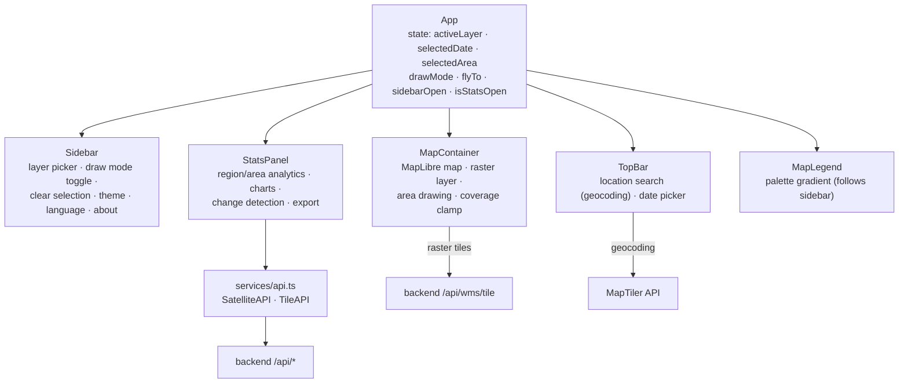
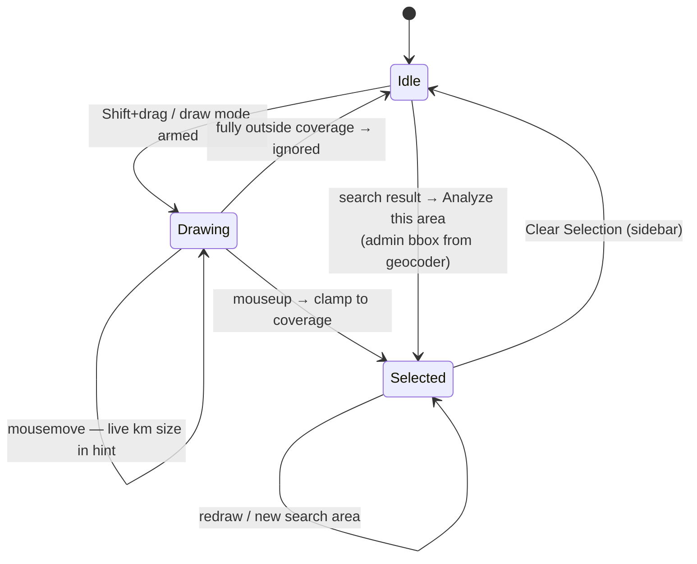

# Frontend Architecture

React 18 + TypeScript + Vite SPA. MapLibre GL for the map, Chart.js for
charts, Tailwind for styling.

## Component tree & state

All shared state lives in `App` — there is no state library; props flow down,
callbacks flow up.

Cross-cutting concerns:

- **`useTranslation`** — module-level store + `useSyncExternalStore`, so a
  language toggle re-renders every subscriber (EN/SK, persisted in
  localStorage).
- **Theme** — `dark` class on `<html>`, persisted; `MapContainer` watches it
  with a `MutationObserver` and swaps the basemap style (dataviz ↔
  dataviz-dark), re-adding overlays after the style loads.
- **`src/config.ts`** — Slovakia coverage bbox, map bounds/zoom limits,
  `clampAreaToCoverage`, `areaSizeKm`. Keep in sync with backend
  `COVERAGE_BBOX`.

## Area selection flow

Selecting an area opens `StatsPanel`, which fires four parallel requests
(stats, timeseries, histogram, change) and offers **Load data for this
area** when the DB has no pixels for the date.

## StatsPanel modes

| Mode | Trigger | Data source |
|---|---|---|
| Region | no area selected | `region_statistics` via `/api/statistics/*` (region dropdown from `/api/statistics/regions`) |
| Area | area selected | `pixel_data` via `/api/tiles/area/*` |

Both modes share the date-range inputs (From/To). Export buttons produce a
chart PNG and a self-contained HTML report.

## API layer

`src/services/api.ts` — thin `fetch` wrappers returning typed results and
swallowing errors into `null`/`[]` (UI treats them as "no data"):

- `SatelliteAPI`: `fetchRegions`, `fetchRegionHistory`
- `TileAPI`: `fetchAreaStatistics`, `fetchAreaTimeseries`,
  `fetchAreaHistogram`, `fetchAreaChange`, `fetchPixels`

## Build

- Vite; path alias `@ → src`.
- Manual chunks: `maplibre` (~1 MB — the library itself), `charts`
  (~176 kB), app (~190 kB) — heavy libs cache independently of app code.
- Env: `VITE_API_URL` (backend), `VITE_MAPTILER_KEY` (basemap + geocoding).
